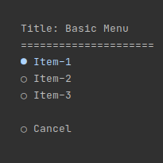

<div align="center">
  <h1>ConsoleMenu</h1>
  <br />
  <a href="#getting-started"><strong>Getting Started »</strong></a>
  <br />
  <br />
  <a href="https://github.com/HamidMolareza/ConsoleMenu/issues/new?assignees=&labels=bug&template=BUG_REPORT.md&title=bug%3A+">Report a Bug</a>
  ·
  <a href="https://github.com/HamidMolareza/ConsoleMenu/issues/new?assignees=&labels=enhancement&template=FEATURE_REQUEST.md&title=feat%3A+">Request a Feature</a>
  .
  <a href="https://github.com/HamidMolareza/ConsoleMenu/issues/new?assignees=&labels=question&template=SUPPORT_QUESTION.md&title=support%3A+">Ask a Question</a>
</div>

<div align="center">
<br />

[](https://github.com/HamidMolareza)


[](https://github.com/HamidMolareza/ConsoleMenu/issues?q=is%3Aissue+is%3Aopen+label%3A%22help+wanted%22)

</div>

## About

The `ConsoleMenu` library is a simple tool for **C#** programmers to easily create interactive console menus.
This library streamlines the process of creating console menus by providing a simple and intuitive API for defining and displaying menus.
With support for chaining functions, developers can create elegant and user-friendly console menus effortlessly.

Feel free to use the `ConsoleMenu` library to enhance your console applications with user-friendly menus. If you have any questions, feedback, or suggestions, please don't hesitate to contact us.

### Demo



### Compatibility

The `ConsoleMenu` library is built using **.NET Core 3.1** and C# 9. It should be compatible with compatible versions of .NET Core and .NET 5+. Please ensure that your project targets a compatible framework version.

## Getting Started

To start using the `ConsoleMenu` library, follow these simple steps:

1. **Installation**: Add the ConsoleMenu library to your project by referencing the appropriate NuGet package (coming soon).

2. **Create a Menu**:

   Use the chaining of functions to define your console menu. Here's an example:

   ```csharp
   var selectedItem = new RadioMenu()
       .AddText("Title: Basic Menu")
       .AddSeparation("=")
       .AddItem("Item-1")
       .AddItem("Item-2")
       .AddItem("Item-3")
       .AddSeparation()
       .AddItem("Cancel")
       .SetMarginAuto()
       .Run();
   ```

3. **Process User Input**:

   After the menu is displayed and the user makes a selection, the selected option is returned. You can then manage the user's choice according to your program's logic:

   ```csharp
   Console.WriteLine($"Selected ID: {selectedItem?.Id}");
   ```

## Example

Here's a complete example demonstrating the usage of the `ConsoleMenu` library:

```csharp
using System;

namespace ConsoleMenuExample
{
    class Program
    {
        static void Main(string[] args)
        {
            var selectedItem = new RadioMenu()
                .AddText("Title: Basic Menu")
                .AddSeparation("=")
                .AddItem("Item-1")
                .AddItem("Item-2")
                .AddItem("Item-3")
                .AddSeparation()
                .AddItem("Cancel")
                .SetMarginAuto()
                .Run();

            Console.WriteLine($"Selected ID: {selectedItem?.Id}");
        }
    }
}
```

## Features

- Create console menus with minimal code using the chaining of functions.
- Display attractive and well-formatted menus in the console for user interaction.
- Capture user input and return the selected option for further processing.
- Set custom margins to control the layout of the menu.

## Support

Reach out to the maintainer at one of the following places:

- [GitHub issues](https://github.com/HamidMolareza/ConsoleMenu/issues/new?assignees=&labels=question&template=SUPPORT_QUESTION.md&title=support%3A+)

## FAQ

**Q: What is the purpose of the ConsoleMenu library?**

A: The ConsoleMenu library simplifies the creation of console menus in C# applications. It allows developers to define menus using a chainable syntax and provides a convenient way to capture user input and manage selected options.

**Q: How can I install the ConsoleMenu library?**

A: The library can be installed by referencing the appropriate NuGet package (details coming soon). Typically, you can use the NuGet Package Manager Console or the .NET CLI to add the package to your project.

**Q: Can I customize the appearance of the console menus?**

A: While the library focuses on providing a streamlined menu creation process, you can still control aspects like margins and separators. The library aims to strike a balance between simplicity and customization.

**Q: Is the ConsoleMenu library compatible with .NET 5 or later?**

A: Yes, the ConsoleMenu library is built using .NET Core 3.1 and C# 9, and it should be compatible with compatible versions of .NET Core and .NET 5+. Ensure that your project targets a compatible framework version.

**Q: How can I contribute to the ConsoleMenu library?**

A: Contributions are welcome! If you find a bug, have a suggestion, or want to contribute enhancements, please open an issue on the GitHub repository. You can also submit pull requests to contribute to the project.

## Contributing

Contributions to the ConsoleMenu library are welcome! If you find a bug or want to suggest an enhancement, please open an issue on the GitHub repository. You can also submit pull requests to contribute to the project.

## Authors & contributors

The original setup of this repository is by [HamidMolareza](https://github.com/HamidMolareza).

## Security

`ConsoleMenu` follows good practices of security, but 100% security cannot be assured. `ConsoleMenu` is provided **"as
is"** without any **warranty**.

_For more information and to report security issues, please refer to our [security documentation](docs/SECURITY.md)._

## License

This project is licensed under the **GPLv3**.

See [LICENSE](LICENSE) for more information.

## Related

Here are some related projects:

- **Colorful.Console**: [GitHub Repository](https://github.com/tomakita/Colorful.Console)
   Enhance the visual appeal of your console menus by using the Colorful.Console library. It allows you to apply rich text formatting and color to your console output, making your menus more visually appealing and user-friendly.

- **CommandLineParser**: [GitHub Repository](https://github.com/commandlineparser/commandline)
   If your console application involves command-line arguments and parameters, the CommandLineParser library can help you easily parse and handle command-line inputs. It provides a convenient way to define and manage command-line options.

- **ConsoleTables**: [GitHub Repository](https://github.com/khalidabuhakmeh/ConsoleTables)
   When displaying tabular data in your console menus, the ConsoleTables library can be useful. It simplifies the process of creating and formatting tables in the console, improving the readability of your output.

- **Figgle**: [GitHub Repository](https://github.com/drewnoakes/figgle)
   Add ASCII art text banners to your console menus using the Figgle library. It can help you create eye-catching titles and headings for your menus, making them stand out and look unique.

- **Spectre.Console**: [GitHub Repository](https://github.com/spectresystems/spectre.console)
   Spectre.Console provides a rich set of features for building interactive and beautifully formatted console applications. It offers support for advanced formatting, tables, progress bars, and more, which can be used to enhance the aesthetics and functionality of your menus.

Remember to check the compatibility and documentation of these projects to ensure they align with your requirements and goals. Integrating these related projects with the ConsoleMenu library can help you create more feature-rich and user-friendly console applications.


